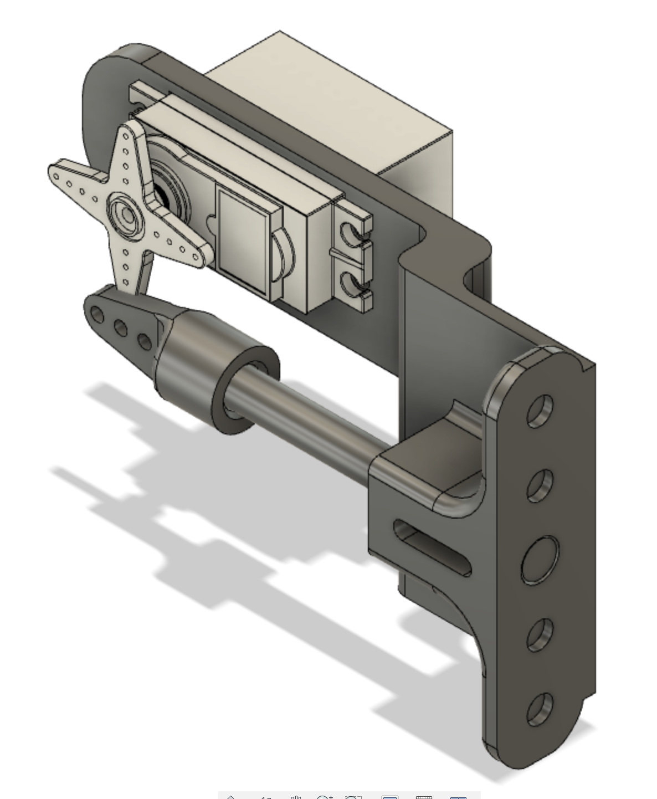

# Roller Door Lock

Simple project to control a 3D printed locking mechanism for a garage roller door.

The final setup allows me to lock and unlock my old and un-motorised garage door remotely via HomeKit.

## Setup

Create a copy of `conf.json` called `conf.local.json`. Fill in your Wifi and MQTT broker details.

## Dependancies
- I used [mosquitto broker](https://mosquitto.org/) in this project.
- For homekit integration install [homebridge](https://homebridge.io/how-to-install-homebridge) and the [homebridge-mqtt](https://github.com/cflurin/homebridge-mqtt#readme) plugin.

## Hardware

### 3D Printing
The following items were printed in PLA 0.4mm nozzle on a Prusa i3 mk3:
- `cad/bolt guide v3.stl`
- `cad/bolt control horn v1.stl`

### Assembly Notes
The bolt was a shortened 8mm OD smooth steel rod from an old Prusa printer left over from a previous upgrade. NOTE: Make sure to measure your setup to get an appropriate length.

The control horn attaches to the rod using glue and the horn attaches to the servo using chicken wire.

Finally, the assembly attaches to my garage door using two sheet metal screws.

For detailed informaiton see `cad/garage door lock assembly v4.step`.

### Essential Electronics
- Raspberry Pi Pico W with Soldered Male Headers
- Raspberry Pi 4 Power Supply (Official) - USB-C 5.1V 15.3W (White)	1
- PiicoDev Precision Temperature Sensor TMP117
- PiicoDev Cable 50mm	x4
- PiicoDev Cable 100mm	x5
- PiicoDev OLED Display Module (128x64) SSD1306
- PiicoDev Buzzer Module
- PiicoDev Expansion Board for Pico (Non-Recharging)
- PiicoDev Servo Driver (4 Channel)

### Optional Electronics
Could be used to extend the project in the future.
- USB Cable Type A to Micro B (1m)	x4
- Heat Shrink Kit
- 16mm Illuminated Pushbutton - Red Latching On/Off Switch	x2
- Resistor 330 Ohm 1/4 Watt PTH - 20 pack (Thick Leads)	1
